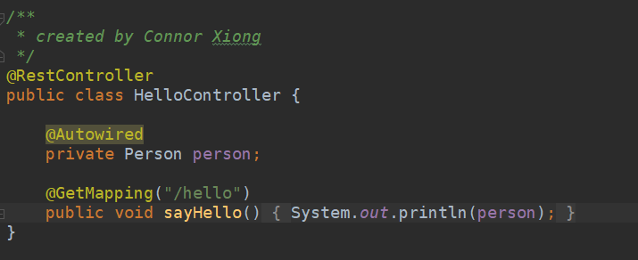
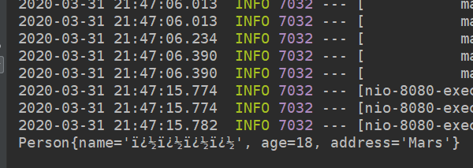
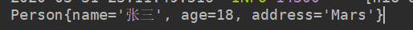
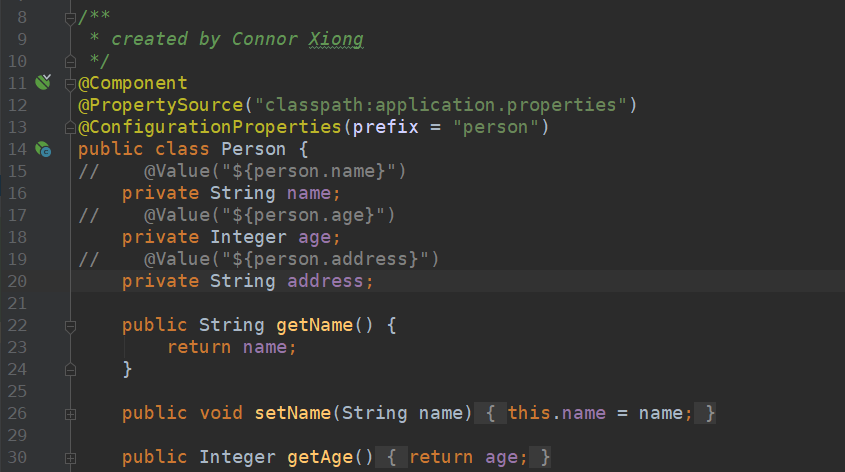
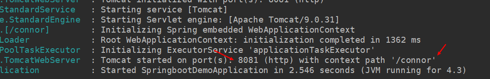
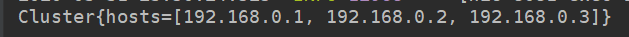

# spring boot的配置文件

通过上一章已经了解到，springboot项目是一个约定大于配置的项目，大部分的配置，通过相关的默认处理，都已经配置好了，我们直接拿来使用即可。

但还是有很多种情况，我们需要自定义一些配置，来供我们业务开发的要求，比如说配置其他的数据源之类的，这个时候，就需要自己去在配置文件中定义我们所需要的东西。

配置文件一般分为application.properties和application.yml，一个springboot项目创建之后，在src/main/resources目录下，一般会看到一个这样的配置文件(application.properties)。

对于这两种文件来说，

- .properties文件是以key=value的形式编写，很多种情况下，前缀大部分都相同，会造成冗余的现象。
- .yml是一个可读性高，用来表达数据序列化的格式的文件。

下面将介绍配置文件如何在项目中使用

## 如何使用

### 普通注入

1. 在application.properties中添加如下代码

```properties
person.name=张三
person.age=18
person.address=Mars
```

2. 在项目下创建一个javaBean，包含name，age，address属性

```java
@Component
@PropertySource("classpath:application.properties")
public class Person {
    @Value("${person.name}")
    private String name;
    @Value("${person.age}")
    private Integer age;
    @Value("${person.address}")
    private String address;
    
    // getters and setters
    
}
```

此处用了3个注解，分别是：

- @Component注解用来表示这个类由spring管理，把普通的pojo类实例化到spring容器中
- @PropertySource注解作用是加载指定的.properties文件到spring的环境之中，配合@Value使用
- @Value注解作用是将.properties中的对应的属性的值，注入到当前使用此注解的属性上面去

3. 在controller中注入Person类，将person打印出来，看看是否能注入属性成功





这里能看得到，person的属性通过properties注入成功了，但是中文出现了乱码，只要在setting中把项目的编码设置成utf-8，把*Transparent native-to-ascii conversion*前面的勾勾上，再重新编辑一下properties文件即可显示正确的字符了。



### 其他方式注入

上面的方法是一般情况下使用的，但是有个缺点，就是application.properties文件的属性中，person的前缀都是一样的，只是后面的名字不同，作为一个程序员，肯定要找到更加高(偷)效(懒)的方式去写呀！

所以这个时候介绍另一种注入的方式，首先将JavaBean中的@Value注解全都去掉，而在类名上增加一个注解@ConfigurationProperties



可以看到，这个注解的参数中，有一个prefix，顾名思义，是去properties中寻找以person为前缀的属性，注入到JavaBean中去。

**注：JavaBean的属性名称必须和properties文件中的后缀保持一致**

### yaml文件方式注入

使用yaml文件做配置的话，可以替换掉application.properties，创建一个文件名为application.yml或者application.yaml的文件。

**yaml配置是有序的，properties配置是无序的**

**自定义的yaml文件尚不支持使用@PropertySource注解直接注入到项目之中**

下面来看看如何使用yaml配置

1. 首先创建一个application.yml，语法是k: v，需要注意的是，冒号后面与值之间要有一个空格

```yaml
server:
  port: 8081
  servlet:
    context-path: /connor
```



启动项目之后，就能看到项目的端口号改变了，项目的context-path路径也改变了。

2. 之前说到yaml文件是有序的，那么怎么体现出它的有序呢

现在再在yaml中添加一下属性

```yml
server:
  port: 8081
  servlet:
    context-path: /connor
cluster:
  hosts:
    - 192.168.0.1
    - 192.168.0.2
    - 192.168.0.3
```

创建一个Cluster类

```java
@Component
@ConfigurationProperties(prefix = "cluster")
public class Cluster {
    List<String> hosts;
    
    // getters and setters
    // toString()
}
```

然后在controller中注入这个类，并打印出这个对象



所以，yaml配置能够注入一个数组/集合，同时也是保持有序的方式注入。

