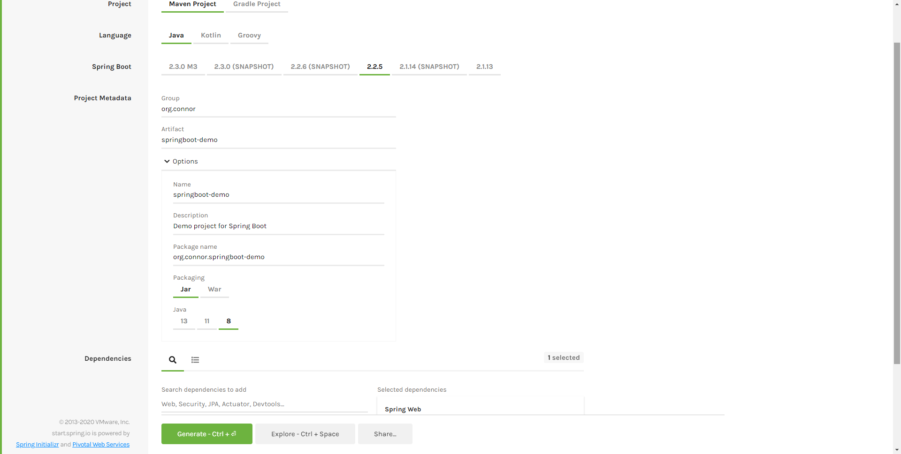
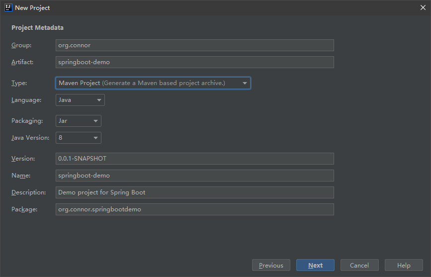
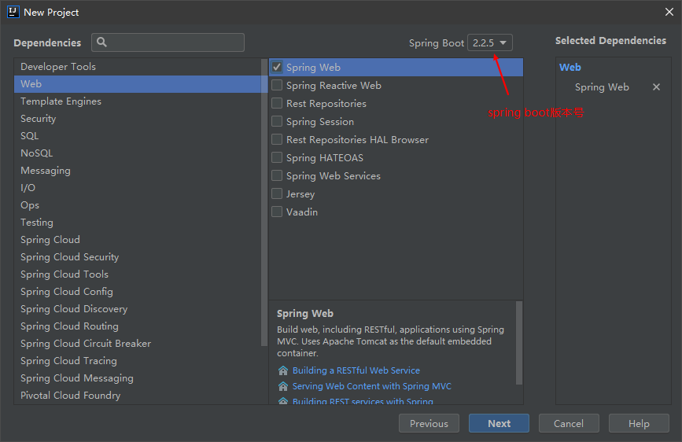
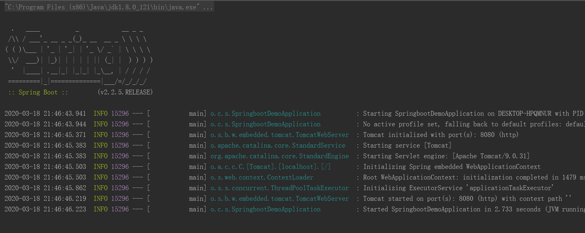
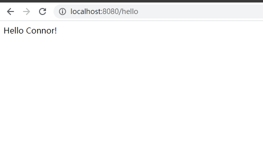

# 快速入门
## 构建方式
spring boot项目可以通过以下几种方式搭建
- 在spring boot网站通过maven构建下载一个压缩包，导入至IDE中
- 使用idea快速搭建出一个spring boot项目
- ......

这里展示两种搭建spring boot项目的方式

### 1.maven构建
首先访问[https://start.spring.io/](https://start.spring.io/)，project选择Maven Project，language选择Java，spring boot版本选择默认版本，项目元数据根据自己的需要填写，比如packaging方式是Jar还是War，JDK版本是8或以上等，构建方式是Maven，所以可以在dependencies中选择要依赖的东西，详细细节可以参考下图

信息填写完成后，点击绿色的Generate，或者快捷键Ctrl+回车即可下载压缩包，解压之后用IDE将文件夹通过引入Maven项目的方式引入即可。


### 2. idea构建
使用idea构建spring boot项目同样很方便快速，在idea中new project，左边选择Spring Initializr，右边选择JDK，下面让你选择Service URL，默认的正好就是第一种构建方式的访问地址，可以想象得到，idea其实也是通过第一种方式创建spring boot项目的。

点击next就到下一步，输入项目的元数据

再点击next，就到了选择依赖的地方，还能选择spring boot的版本号，之后再finish

这样进入idea的界面后，Maven会自动引入spring boot所需要的依赖包，一个spring boot项目就这样搭好了。


## 项目结构介绍
如一般的Maven/SSM工程一样，项目目录中分别含有java、resources、test的文件夹，分别用以存放Java文件、配置文件和测试文件，还有着pom.xml，但却缺少了web.xml文件和applicationContext.properties等文件，这是为什么呢？

> spring boot遵循着约定优于配置的理念，特点是简单、快速和便捷。spring boot提供了一系列的Starter依赖来简化jar包的配置。

所以我们创建了一个spring boot项目之后，一切工作都如我们创建了普通的SSM框架的默认配置一样，接下来，我在包结构中创建一个controller，里面写一个简单的返回字符串的方法。

src/main/java/org.connor.springbootdemo.controller

##### Ps:controller的package目录要和SpringbootDemoApplication在同一级

``` Java
package org.connor.springbootdemo.controller;

import org.springframework.web.bind.annotation.GetMapping;
import org.springframework.web.bind.annotation.RestController;

/**
 * created by Connor Xiong
 */
@RestController
public class HelloController {
    @GetMapping("/hello")
    public String sayHello() {
        return "Hello Connor!";
    }
}

```
然后右键点击SpringbootDemoApplication，点击run，虽然我没有手动配置Tomcat服务器，但是因为spring boot内置了Tomcat，所以run之后就是Tomcat启动起来了。

在浏览器上输入localhost:8080/hello，就可以看到在HelloController中方法返回的字符串了。
